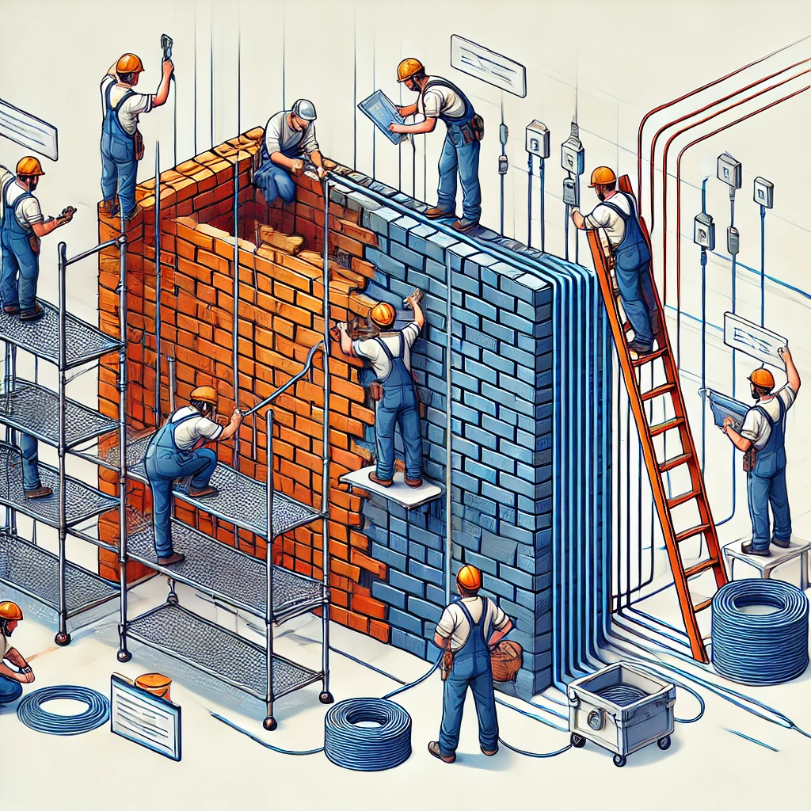

# Web Essentials HTML, CSS, and JavaScript

Think of **_HTML_** as the bricks that form the foundation and structure of a webpage. Each HTML element is like an individual brick, contributing to the overall layout.

**_CSS_** is like the plaster and paint, **_styling and arranging_** the bricks to look appealing.

**_JavaScript_** is like electrical wiring, bringing **_interactivity_** and **_functionality_**.

HTML is nested and hierarchical, just like a tree structure or a family tree. Each element can have parent, child, and sibling relationships.

